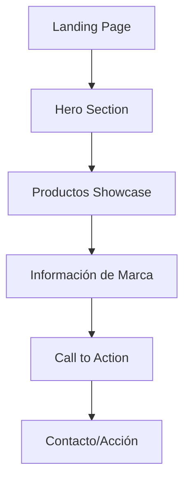

# Documento de Requerimientos - Landing Page Fruco

## 1. Visión General del Producto

Landing page elegante y minimalista para la marca Fruco que presenta sus productos de manera sofisticada usando animaciones fluidas y un diseño moderno. La página utiliza los colores corporativos del logotipo (negro, verde y rojo) para crear una experiencia visual cohesiva y premium.

Objetivo: Crear una presencia web elegante que refleje la calidad de los productos Fruco y genere engagement a través de una experiencia de usuario inmersiva.

## 2. Características Principales

### 2.1 Módulos de Funcionalidad

Descripción general de las secciones de la landing page:

1. **Hero Section**: Logo principal, mensaje de bienvenida, animación de entrada
2. **Productos Showcase**: Galería interactiva de productos con animaciones scroll
3. **Información de Marca**: Historia y valores de Fruco
4. **Call to Action**: Sección de contacto o acción principal

### 2.2 Detalles de Secciones

| Sección | Módulo | Descripción de Funcionalidad |
|---------|--------|-------------------------------|
| Hero Section | Logo y Título | Mostrar logo_fruco.avif con animación de entrada suave, título principal con efecto fade-in |
| Hero Section | Navegación Fluida | Scroll suave hacia secciones sin header tradicional, indicadores visuales de scroll |
| Productos Showcase | Galería Interactiva | Mostrar fruco_artesano.avif, fruco_clasico.avif, fruco_eco.avif, fruco_pasta_pizza.avif con animaciones parallax |
| Productos Showcase | Efectos Hover | Transiciones elegantes en hover con escalado y cambios de opacidad |
| Información de Marca | Contenido Textual | Descripción de la marca con animaciones de aparición basadas en scroll |
| Call to Action | Botón Principal | Botón de acción con hover negro y animaciones micro-interactivas |

## 3. Flujo Principal

Flujo de navegación del usuario:

1. **Entrada**: Usuario llega a la landing page y ve la animación de bienvenida
2. **Exploración**: Scroll fluido a través de las secciones con animaciones GSAP
3. **Productos**: Interacción con la galería de productos mediante scroll y hover
4. **Información**: Lectura de contenido de marca con animaciones de aparición
5. **Acción**: Interacción con call to action para contacto o compra

## 4. Diseño de Interfaz de Usuario

### 4.1 Estilo de Diseño

- **Colores Primarios**: Negro (#000000) para fondo, Verde y Rojo extraídos del logo_fruco.avif
- **Colores Secundarios**: Negro para hover de enlaces, blancos y grises para texto
- **Estilo de Botones**: Minimalistas con bordes sutiles, hover con fondo negro
- **Tipografía**: Fuentes modernas y elegantes, tamaños jerárquicos claros
- **Estilo de Layout**: Diseño de una sola página, secciones full-height, espaciado generoso
- **Iconos y Emojis**: Minimalistas, líneas finas, coherentes con la estética premium

### 4.2 Resumen de Diseño por Sección

| Sección | Módulo | Elementos UI |
|---------|--------|---------------|
| Hero Section | Logo y Título | Logo centrado con animación fade-in, tipografía grande y elegante, fondo negro sólido |
| Hero Section | Indicador Scroll | Flecha o indicador sutil para invitar al scroll, animación pulsante |
| Productos Showcase | Galería | Grid responsivo, imágenes con efectos parallax, overlays con información del producto |
| Productos Showcase | Transiciones | Animaciones suaves de entrada basadas en scroll, efectos de hover elegantes |
| Información de Marca | Contenido | Texto con animaciones de aparición, layout asimétrico elegante |
| Call to Action | Botón Principal | Botón prominente con animaciones micro, hover negro, tipografía clara |

### 4.3 Responsividad

Diseño mobile-first con adaptación fluida a desktop. Optimización táctil para dispositivos móviles con gestos de scroll suaves y elementos interactivos apropiados para touch.