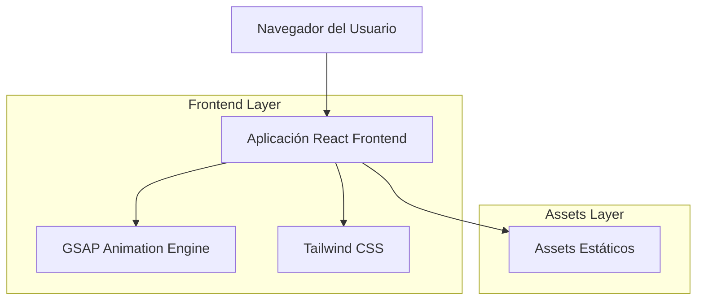

# Documento de Arquitectura Técnica - Landing Page Fruco

## 1. Diseño de Arquitectura



## 2. Descripción de Tecnologías

* Frontend: React\@18 + TypeScript + Tailwind CSS 4+ + Vite

* Animaciones: GSAP\@3 + ScrollTrigger

* Package Manager: Bun

* Build Tool: Vite

* Assets: Imágenes AVIF optimizadas

## 3. Definiciones de Rutas

| Ruta | Propósito                                      |
| ---- | ---------------------------------------------- |
| /    | Landing page principal con todas las secciones |

## 4. Estructura de Componentes

### 4.1 Componentes Principales

```typescript
// Estructura de componentes React
interface LandingPageProps {
  children?: React.ReactNode;
}

interface HeroSectionProps {
  logoSrc: string;
  title: string;
  subtitle?: string;
}

interface ProductShowcaseProps {
  products: Product[];
}

interface Product {
  id: string;
  name: string;
  imageSrc: string;
  description?: string;
}

interface BrandInfoProps {
  content: string;
  highlights: string[];
}

interface CallToActionProps {
  title: string;
  buttonText: string;
  onAction: () => void;
}
```

### 4.2 Configuración GSAP

```typescript
// Configuración de animaciones GSAP
interface GSAPConfig {
  scrollTrigger: {
    trigger: string;
    start: string;
    end: string;
    scrub: boolean;
  };
  timeline: {
    duration: number;
    ease: string;
  };
}

interface AnimationPresets {
  fadeIn: GSAPConfig;
  slideUp: GSAPConfig;
  parallax: GSAPConfig;
  scaleOnHover: GSAPConfig;
}
```

## 5. Estructura del Proyecto

```
fruco-land/
├── src/
│   ├── components/
│   │   ├── HeroSection.tsx
│   │   ├── ProductShowcase.tsx
│   │   ├── BrandInfo.tsx
│   │   └── CallToAction.tsx
│   ├── hooks/
│   │   ├── useGSAP.ts
│   │   └── useScrollAnimations.ts
│   ├── utils/
│   │   ├── animations.ts
│   │   └── constants.ts
│   ├── assets/
│   │   ├── fruco_artesano.avif
│   │   ├── fruco_clasico.avif
│   │   ├── fruco_eco.avif
│   │   ├── fruco_pasta_pizza.avif
│   │   └── logo_fruco.avif
│   ├── styles/
│   │   └── globals.css
│   ├── App.tsx
│   └── main.tsx
├── public/
├── package.json
├── tsconfig.json
├── vite.config.ts
└── README.md
```

## 6. Configuración de Dependencias

### 6.1 Dependencias Principales

```json
{
  "dependencies": {
    "react": "^18.2.0",
    "react-dom": "^18.2.0",
    "gsap": "^3.12.2"
  },
  "devDependencies": {
    "@types/react": "^18.2.0",
    "@types/react-dom": "^18.2.0",
    "@vitejs/plugin-react": "^4.0.0",
    "autoprefixer": "^10.4.14",
    "postcss": "^8.4.24",
    "tailwindcss": "^4.0.0",
    "typescript": "^5.0.0",
    "vite": "^4.4.0"
  }
}
```

### 6.2 Configuración de Vite

```typescript
// vite.config.ts
import { defineConfig } from 'vite';
import react from '@vitejs/plugin-react';

export default defineConfig({
  plugins: [react()],
  assetsInclude: ['**/*.avif'],
  build: {
    rollupOptions: {
      output: {
        assetFileNames: 'assets/[name].[hash][extname]'
      }
    }
  }
});
```

### 6.3 Configuración de TypeScript

```json
{
  "compilerOptions": {
    "target": "ES2020",
    "useDefineForClassFields": true,
    "lib": ["ES2020", "DOM", "DOM.Iterable"],
    "module": "ESNext",
    "skipLibCheck": true,
    "moduleResolution": "bundler",
    "allowImportingTsExtensions": true,
    "resolveJsonModule": true,
    "isolatedModules": true,
    "noEmit": true,
    "jsx": "react-jsx",
    "strict": true,
    "noUnusedLocals": true,
    "noUnusedParameters": true,
    "noFallthroughCasesInSwitch": true
  },
  "include": ["src"],
  "references": [{ "path": "./tsconfig.node.json" }]
}
```

## 7. Configuración de Estilos

### 7.1 Configuración de Tailwind CSS 4+

Tailwind CSS 4+ utiliza configuración basada en CSS en lugar de archivos JavaScript. No se requiere `tailwind.config.js`.

### 7.2 Estilos Globales

```css
/* src/styles/globals.css */
@import "tailwindcss";

/* Configuración de colores personalizados para Tailwind CSS 4+ */
@theme {
  --color-fruco-green: #2D5016;
  --color-fruco-red: #C41E3A;
  --color-fruco-black: #000000;
  
  --font-family-elegant: Inter, system-ui, sans-serif;
  
  --animate-fade-in: fadeIn 1s ease-in-out;
  --animate-slide-up: slideUp 0.8s ease-out;
}

@layer base {
  html {
    scroll-behavior: smooth;
  }
  
  body {
    @apply bg-fruco-black text-white font-elegant;
    overflow-x: hidden;
  }
}

@layer components {
  .section-container {
    @apply min-h-screen flex items-center justify-center px-4;
  }
  
  .elegant-button {
    @apply px-8 py-3 border border-white/20 hover:bg-fruco-black hover:border-white transition-all duration-300;
  }
}

/* Definición de keyframes para animaciones */
@keyframes fadeIn {
  from { opacity: 0; }
  to { opacity: 1; }
}

@keyframes slideUp {
  from { transform: translateY(20px); opacity: 0; }
  to { transform: translateY(0); opacity: 1; }
}
```

## 8. Optimización y Performance

### 8.1 Optimizaciones de Assets

* Uso de formato AVIF para imágenes optimizadas

* Lazy loading de imágenes con Intersection Observer

* Preload de assets críticos

### 8.2 Optimizaciones de Animaciones

* Uso de `will-change` CSS para elementos animados

* RequestAnimationFrame para animaciones suaves

* Debounce en eventos de scroll

### 8.3 Bundle Optimization

* Tree shaking automático con Vite

* Code splitting por componentes

* Compresión de assets en build

